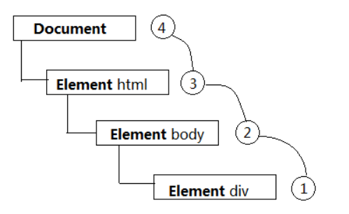
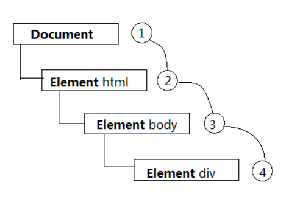

# 事件

`Event` 接口表示在 DOM 中出现的事件

一些事件是由用户触发的，例如鼠标或键盘事件；而其他事件常由 API 生成，例如指示动画已经完成运行的事件，视频已被暂停等等。事件也可以通过脚本代码触发，例如对元素调用 `HTMLElement.click()` 方法，或者定义一些自定义事件，再使用 `EventTarget.dispatchEvent()` 方法将自定义事件派发往指定的目标

当有很多嵌套的元素，并且每一个元素都有着自己的事件处理函数，事件处理过程会变得非常复杂。尤其当一个父元素和子元素绑定有相同类型的事件处理函数的时候。因为结构上的重叠，事件处理函数可能会依次被触发，触发的顺序取决于事件冒泡和事件捕获在每一个元素上的设置情况。

## 属性

**Event.bubbles**

返回一个布尔值，表明当前事件是否会向 DOM 树上层元素冒泡

**Event.cancelable**

表明该事件是否可以被取消，即事件是否可以像从未发生一样被阻止。

如果事件不能被取消，则其 cancelable 属性的值为 false，且事件发生时无法在事件监听回调中停止事件。

大部分由用户与页面交互产生的原生浏览器事件都可以被取消。取消 `click`、`wheel` 或 `beforeunload` 事件将分别阻止用户点击某些元素、滚动页面或跳离页面

使用 JavaScript 代码创建的自定义事件，可以在初始化事件的时候声明该事件是否可以被取消

要取消一个事件的默认行为，可以调用该事件的 `preventDefault()` 方法

**Event.composed**

指示该事件是否可以从 Shadow DOM 传递到一般的 DOM

如果返回的值为 `true`，表明当事件到达 shadow DOM 的根节点时，事件可以从 shadow DOM 传递到一般 DOM。当然，事件要具有可传播性，即该事件的 `bubbles` 属性必须为 `true`。你也可以通过调用` composedPath()` 来查看事件从 shadow DOM 传播到普通 DOM 的路径。

如果属性值为 `false`，那么事件将不会跨越 shadow DOM 的边界传播。

**Event.currentTarget**

事件处理程序当前正在处理事件的那个元素

**Event.eventPhase**

表示事件流当前处于哪一个阶段

下面这些值表示了事件流当前执行的阶段

| 常量                    | 值  | 描述                                                                                                                                                                                                            |
| ----------------------- | --- | --------------------------------------------------------------------------------------------------------------------------------------------------------------------------------------------------------------- |
| `Event.NONE`            | 0   | 没有事件正在被处理                                                                                                                                                                                              |
| `Event.CAPTURING_PHASE` | 1   | 事件正在被目标元素的祖先对象处理。这个处理过程从 `Window` 开始，然后 `Document`, 然后是 `HTMLHtmlElement`, 一直这样，直到目标元素的父元素                                                                       |
| `Event.AT_TARGET`       | 2   | 事件对象已经抵达目标，如果 `Event.bubbles` 的值为 `false`，对事件对象的处理在这个阶段后就会结束                                                                                                                 |
| `Event.BUBBLING_PHASE`  | 3   | 事件对象逆向向上传播回目标元素的祖先元素，从父亲元素开始，并且最终到达包含元素 `Window`. 这就是冒泡，并且只有 `Event.bubbles` 值为 `true` 的时候才会发生。为这个阶段注册的 Event listeners 在这个过程中被触发。 |

**target**

事件的目标

**type**

被触发的事件的类型

## 构造函数

`Event()` 构造函数，创建一个新的事件对象

### 语法

```js
event = new Event(typeArg, eventInit);
```

### 参数

**typeArg**

表示所创建事件的名称

**eventInit** (可选)

是 `EventInit` 类型的字典，接受以下字段：

- `bubbles`，可选，`Boolean` 类型，默认值为 `false`，表示该事件是否冒泡
- `cancelable`，可选，`Boolean` 类型，默认值为 `false`，表示该事件能否被取消。
- `composed`，可选，`Boolean` 类型，默认值为 `false`，指示事件是否会在影子 DOM 根节点之外触发侦听器。

### 示例

```js
// 创建一个支持冒泡且不能被取消的 look 事件

var ev = new Event('look', { bubbles: true, cancelable: false });
document.dispatchEvent(ev);

// 事件可以在任何元素触发，不仅仅是 document
myDiv.dispatchEvent(ev);
```

## 事件流

事件流所描述的就是从页面中接受事件的顺序，事件流包括三个阶段：事件捕获阶段（Capture Phase）、处于目标阶段（Target Phase）和事件冒泡阶段（Bubbling Phase）

### 事件冒泡

IE 的事件流叫做 **事件冒泡（Event Bubbling）**，即事件开始时由最具体的元素（文档中嵌套层次最深的那个节点）接收，然后逐级向上传播到较为不具体的节点，直到 document 对象

下图展示了事件冒泡的过程：



### 事件捕获

事件捕获的思想是不太具体的节点应该更早接收到事件，而最具体的节点应该最后接收到事件

下图展示了事件冒泡的过程：



## 事件委托

又称事件代理，是利用事件冒泡的特性，将本应该绑定在多个元素上的事件绑定在他们的祖先元素上，实现处理程序对多个子孙级元素的某类型事件管理。

**优点**

- 减少内存消耗

  DOM 树层级较深，绑定事件越多，浏览器内存占用越大

- 动态绑定事件

  很多场景需要开发者通过 AJAX 或者用户动态增加或者去除列表项元素，那么在每一次改变的时候都需要重新给新增的元素绑定事件，给即将删去的元素解绑事件。

  如果用了事件委托就没有这种麻烦了，因为事件是绑定在父层的，和目标元素的增减是没有关系的，执行到目标元素是在真正响应执行事件函数的过程中去匹配的。

**注意事项**

- 只在必须的地方使用事件委托，比如网络请求的局部刷新区域

- 尽量低减少绑定的层级，不在 `<body>` 元素上，进行绑定

- 减少绑定的次数，如果可以，那么把多个事件的绑定，合并到一次事件委托中去，由这个事件委托的回调，来进行分发

## 参考资料

- [📚 Event](https://developer.mozilla.org/zh-CN/docs/Web/API/Event)
